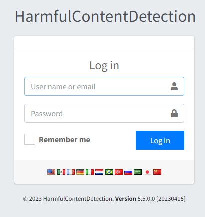
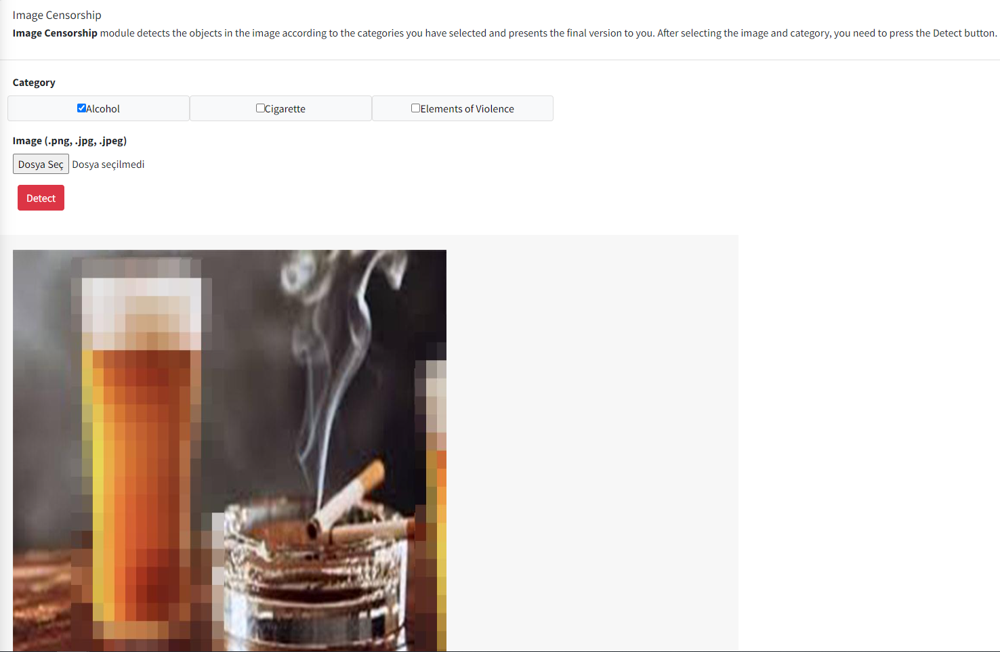
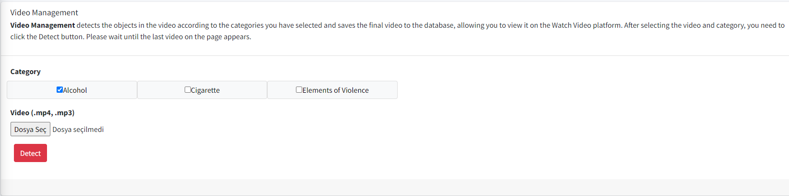
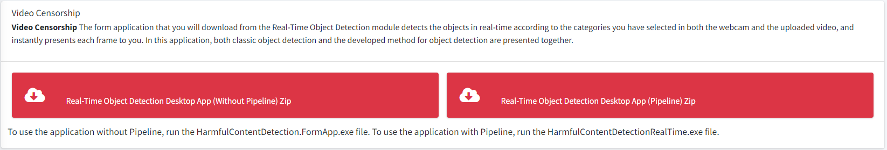
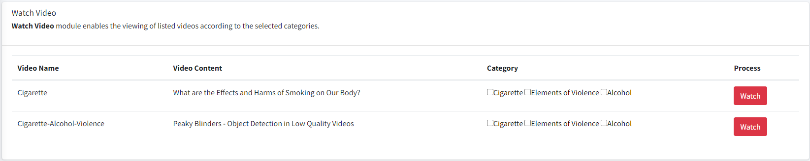
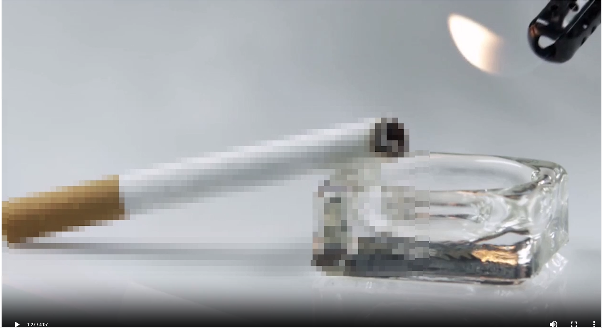

# HarmfulContentDetectionWeb
HarmfulContentDetection web application is a tool developed using ML.NET and ONNX for real-time detection of harmful content in videos, web cameras, and images. The application features a Video Censorship module that allows users to download a form application for detecting objects in real-time based on selected categories in both the web camera and uploaded video. This application combines both classical object detection and specially developed methods for object detection.

## Preparation

Run the following commands for web app in order
```bash
git clone https://github.com/gulsahtan/HarmfulContentDetectionWeb

```
How to use?

https://github.com/gulsahtan/HarmfulContentDetectionWeb/blob/main/HarmfulContentDetection.Web.Mvc/Assets/web.mp4

Run the following commands for in order (with pipeline)
```bash
git clone https://github.com/gulsahtan/HarmfulContentDetectionRealTimeRepo
```

How to use?

https://github.com/gulsahtan/HarmfulContentDetectionWeb/blob/main/HarmfulContentDetection.Web.Mvc/Assets/withpipeline.mp4

Run the following commands for in order (without pipeline)
```bash
git clone https://github.com/gulsahtan/HarmfulContentDetectionDesktop
```

How to use?

https://github.com/gulsahtan/HarmfulContentDetectionWeb/blob/main/HarmfulContentDetection.Web.Mvc/Assets/withoutpipeline.mp4

## Web URL

- Demo application is available at https://harmfulcontentdetection.com/

- User Name: user

- User Password: user12345

## Technologies and Tools

* **Front-end:** CSS, JQuery, JavaScript
* **Back-end:** C#
* **Database:** MsSql
* **Data Modeling:** Google Colab (Yolov5) 
* **Model Viewer:** NETRON
* **Model:** ONNX
* **Authentication:** Jwt
* **IDE:** Visual Studio
* **Version Control System:** Git

## Usage

The HarmfulContentDetection web application includes the following modules:

-Login 

- User Name: user

- User Password: user12345



- Image Censorship module detects the objects in the image according to the categories you have selected and presents the final version to you. After selecting the image and category, you need to press the Detect button.



- Video Management detects the objects in the video according to the categories you have selected and saves the final video to the database, allowing you to view it on the Watch Video platform. After selecting the video and category, you need to click the Detect button. Please wait until the last video on the page appears.



- Video Censorship The form application that you will download from the Real-Time Object Detection module detects the objects in real-time according to the categories you have selected in both the webcam and the uploaded video, and instantly presents each frame to you. In this application, both classic object detection and the developed method for object detection are presented together.



- Data Set module contains the data used to build the models in this application.


- Watch Video module enables the viewing of listed videos according to the selected categories.





## Team

- Associate Professor. Asım Sinan Yüksel: Süleyman Demirel University Computer Engineering Department, Algorithm Design, Architectural Design, Test

- Fatma Gülşah TAN: Süleyman Demirel University Computer Engineering Department, Algorithm Design, Architectural Design, Front-End, Back-End, Test

## License

The source code is free for research and education use only. Any comercial use should get formal permission first.
