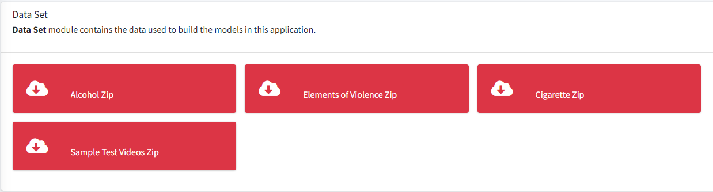

# DeepCens: A Deep Learning Based System for Real-Time Image and Video Censorship
DeepCens is a unique tool designed to detect and censor undesirable content in real-time. It supports 4 content categories: explicit content, alcohol, cigarette, and violence. Our system is designed to work on different platforms, inspired by video watching platforms such as Netflix and YouTube, as well as live broadcasting platforms such as Zoom and Microsoft Teams. The real-time censoring process is user-based and operates dynamically. A user can choose one of the supported content categories (or multiple categories) and the censoring process is applied in real-time accordingly. It employs an improved,fast and accurate YOLO-based algorithm with a pipeline architecture. It supports image and video files, web camera streams.

Below video shows a demo of real-time censored movie stream using our TS-Cens (Two Stage Censorship) algorithm.

**TS-Cens Algorithm:** This simple and effective approach is specifically designed for large videos and performs the censorship in two stages. In the first stage, we decode the video stream and extract frames. We apply harmful content detection on each frame and create a metadata, namely censorship chain that contains the locations and timestamps of harmful content. This censorship chain is buffered to be used in the second stage. The buffered censorship chain is read from the memory, blurring is applied according to the locations and timestamps in the chain and the censored video is played back. As a result, uninterrupted video playback is achieved by maintaining the original FPS. The censorship chain can also be saved as a file for later use. The timestamps and locations of scenes with harmful contents can be edited, updated and exchanged with other people. This approach is best suitable for censored movie streaming where real-time, no-latency playback is required.

**Flow of the TS-Cens algorithm**


https://www.youtube.com/watch?v=-mgzukTrGGg

## Preparation

Clone the repo that contains the web app and run it from Microsoft Visual Studio
```bash
git clone https://github.com/gulsahtan/HarmfulContentDetectionWeb

```
* [Repo of the video player that employs classical approach](https://github.com/gulsahtan/HarmfulContentDetectionDesktop)
* [Repo of the video player that employs pipeline approach](https://github.com/gulsahtan/HarmfulContentDetectionRealTimeRepo)
* [Demo Video](https://github.com/gulsahtan/HarmfulContentDetectionWeb/blob/main/HarmfulContentDetection.Web.Mvc/Assets/web.mp4)


## Technologies and Tools

* **Front-end:** CSS, JQuery, JavaScript
* **Back-end:** C#
* **Database:** MsSql
* **Data Modeling:** Google Colab (Yolov5) 
* **Model Viewer:** NETRON
* **Model:** ONNX
* **Authentication:** Jwt
* **IDE:** Visual Studio
* **Version Control System:** Git

## Usage

- Demo web application is available at https://harmfulcontentdetection.com/

- User Name: user

- User Password: user12345


## DeepCens Modules
* Data Set module contains the data used to build the models.



* Image Censorship module works on images. The user first selects a content category and clicks detect. The image is censored on the fly and showned to the user.


* Video Management module works on videos. It is for admin user. The admin selects a video and a content category/categories for censorship. DeepCens censors the video in the background and stores it in our system. After the censoring process is finished, censored video is presented.


* Video Censorship Module works on videos and web camera streams. It contains two video players which are desktop applications. It showcases two approaches: classical and pipeline approach.


## Team

* **Supervisor:** Assoc. Prof. Dr. Asım Sinan Yüksel, Süleyman Demirel University Computer Engineering Department. **Roles:** Algorithm Design, Architectural Design, Testing

* **Researcher:** Fatma Gülşah TAN, Süleyman Demirel University Computer Engineering Department: **Roles:** Algorithm Design, Architectural Design, Front-End, Back-End, Test

## License

The source code is free for research and education use only. Any comercial use should get formal permission first.
